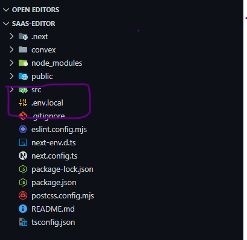

# Code Snippets

A place where developers create and share their code-snippets with others. 

## Why code-snippets ?

1. It support many popular programming languages.
2. User friendly UI and easy to use.
3. Free to use and open source.

## Tech Stacks 

| Technologies | Description                 |
|--------------|-----------------------------|
| Nextjs       | For handling backend        |
| Clerk        | For handling Authentication |
| Convex       | Database for storage        |
| Piston api   | For code executions         |
| Tailwindcss  | Styling                     |

______________________________________________
## This is open source and anyone can use it.

Follow instructions to clone it :-
1. Clone project
```bash
git clone https://github.com/omkashyap28/code-snippets.git
```
2. Install dependencies
```bash
npm i
```
3. Create a file `env.local` in root directory.


4. Set up clerk environment variables from
[Clerk](https://clerk.com) and paste in .env.local file.
5. Set up convex environment variables form [Convex](https://www.convex.dev/) and paste in .env.local file.

6. Run server 
```bash
npm run dev
```
